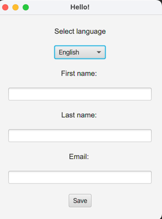
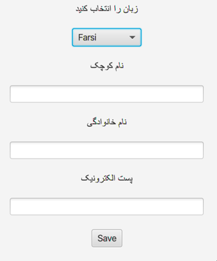
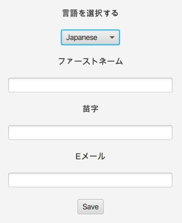
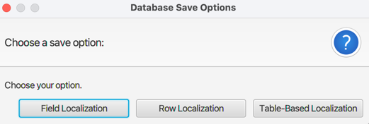
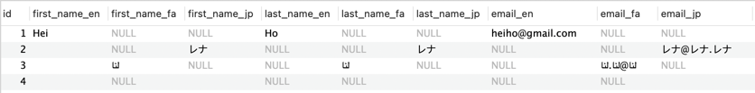
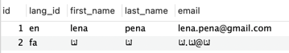
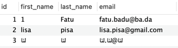

## Localization in JavaFX

This project demonstrates how to implement localization in a JavaFX application. Localization is the process of adapting a product (in this case, a software application) to a specific locale or market. This involves translating the user interface, resizing dialog boxes, customizing features, and so forth.  
### Features

Language Selection: The application allows users to select a language from a dropdown menu. The available languages are English, Farsi, and Japanese. 

Database Integration: The application integrates with a MySQL database to store localized data. Depending on the selected language, data is inserted into specific fields in the database.  

Dynamic UI Updates: The user interface updates dynamically based on the selected language. Labels and other UI elements are updated to display text in the selected language.  

Three Localization Strategies: The application demonstrates three different strategies for storing localized data in a database: field localization, row localization, and table-based localization.  

### Technologies Used

Java: The application is written in Java, a popular, object-oriented programming language.  
JavaFX: JavaFX is used for building the user interface of the application.  
MySQL: MySQL is used as the database management system.  
Maven: Maven is used as the build tool for the project.

### Setup
To run this project, you need to have Java and Maven installed on your machine. You also need to set up a MySQL database named localization and update the database connection details in the HelloController.java file.
Script to create the database and table:
```sql
CREATE TABLE `employee_en` (
  `id` int(11) NOT NULL AUTO_INCREMENT,
  `first_name` varchar(50) DEFAULT NULL,
  `last_name` varchar(50) DEFAULT NULL,
  `email` varchar(100) DEFAULT NULL,
  PRIMARY KEY (`id`)
) ENGINE=InnoDB AUTO_INCREMENT=3 DEFAULT CHARSET=utf8mb4 COLLATE=utf8mb4_general_ci;

CREATE TABLE `employee_fa` (
    `id` int(11) NOT NULL AUTO_INCREMENT,
    `first_name` varchar(50) DEFAULT NULL,
    `last_name` varchar(50) DEFAULT NULL,
    `email` varchar(100) DEFAULT NULL,
    PRIMARY KEY (`id`)
) ENGINE=InnoDB AUTO_INCREMENT=4 DEFAULT CHARSET=utf8mb4 COLLATE=utf8mb4_general_ci;

CREATE TABLE `employee_ja` (
    `id` int(11) NOT NULL AUTO_INCREMENT,
    `first_name` varchar(50) DEFAULT NULL,
    `last_name` varchar(50) DEFAULT NULL,
    `email` varchar(100) DEFAULT NULL,
    PRIMARY KEY (`id`)
) ENGINE=InnoDB AUTO_INCREMENT=4 DEFAULT CHARSET=utf8mb4 COLLATE=utf8mb4_general_ci;

CREATE TABLE `employee_field` (
  `id` int(11) unsigned NOT NULL AUTO_INCREMENT,
  `first_name_en` varchar(100) DEFAULT '',
  `first_name_fa` varchar(100) DEFAULT NULL,
  `first_name_jp` varchar(100) DEFAULT NULL,
  `last_name_en` varchar(100) DEFAULT NULL,
  `last_name_fa` varchar(100) DEFAULT NULL,
  `last_name_jp` varchar(100) DEFAULT NULL,
  `email_en` varchar(100) DEFAULT NULL,
  `email_fa` varchar(100) DEFAULT NULL,
  `email_jp` varchar(100) DEFAULT NULL,
  PRIMARY KEY (`id`)
) ENGINE=InnoDB AUTO_INCREMENT=4 DEFAULT CHARSET=utf8mb4 COLLATE=utf8mb4_general_ci;

CREATE TABLE `employee_row` (
    `id` int(11) unsigned NOT NULL AUTO_INCREMENT,
    `lang_id` varchar(50) DEFAULT NULL,
    `first_name` varchar(100) DEFAULT NULL,
    `last_name` varchar(100) DEFAULT NULL,
    `email` varchar(100) DEFAULT NULL,
    PRIMARY KEY (`id`)
) ENGINE=InnoDB AUTO_INCREMENT=3 DEFAULT CHARSET=utf8mb4 COLLATE=utf8mb4_general_ci;
```

### Usage
Clone the repository.
Navigate to the project directory and run mvn javafx:run to start the application.
Select a language from the dropdown menu.
Enter your first name, last name, and email in the provided text fields.
Click the "Save" button to save the data to the database. You will be prompted to choose a save option (field localization, row localization, or table-based localization).
Check your MySQL database to see the inserted data.

### Code Structure
The main class of the application is HelloController.java. This class handles all the logic for the application, including language selection, database connection, and data insertion. The initialize() method sets up the initial state of the application. The languageBundle() method updates the UI based on the selected language. The languageComboBoxOnAction() method handles the event when a language is selected from the dropdown menu. The saveButtonAction() method handles the event when the "Save" button is clicked. The handleFieldLocalization(), handleRowLocalization(), and handleTableBasedLocalization() methods handle the different localization strategies.  

### Results

UI:

 



When clicking the "Save" button, the application prompts the user to choose a localization strategy:



The data is saved to the database based on the selected localization strategy:
Field Localization:



Row Localization:



Table-Based Localization:



### Contributing
Contributions are welcome. Please open an issue to discuss your ideas or submit a pull request with your changes.
